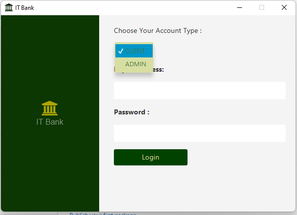

# MyPrivateBank

**MyPrivateBank** ist eine JavaFX-basierte Desktop-Anwendung, die die Verwaltung von Bankkonten für Administratoren und Kunden vereinfacht. Die Anwendung ermöglicht es Administratoren, neue Kunden zu registrieren, Konten zu überwachen und Geldtransaktionen zu verwalten, während Kunden grundlegende Bankfunktionen nutzen können.

## Hauptfunktionen

- **Administratorfunktionen:**
  - Registrierung neuer Kundenkonten
  - Verwaltung und Überwachung von Kundenkonten
  - Löschung von Konten
  - Einzahlung von Geld auf Kundenkonten

- **Kundenfunktionen:**
  - Zugriff auf eigene Konten und Salden
  - Überweisungen und Abhebungen
  - Transaktionshistorie einsehen

## Verwendete Technologien

- **JavaFX 17.0.2:** Für die Benutzeroberfläche der Anwendung.
- **SQLite:** Lokale Datenbank für die Speicherung und Verwaltung der Konten- und Transaktionsdaten.
- **FontAwesomeFX:** Für eine ansprechende und moderne Benutzeroberfläche mit Font Awesome Icons.

## Systemanforderungen

- **Java 11 oder höher** - JavaFX 17 setzt Java 11 oder eine neuere Version voraus.
- **Maven** - Für das Abhängigkeitsmanagement und den Aufbau der Anwendung.

## Anwendung

Nach dem Start der Anwendung können Benutzer und Administratoren sich anmelden und ihre spezifischen Funktionen nutzen.

- **Administratoren** können Kundenkonten erstellen, überwachen, löschen und Einzahlungen vornehmen.
- **Kunden** können ihren Kontostand prüfen, Geld abheben, überweisen und ihre Transaktionshistorie einsehen.

## Autoritation :

- **Admin** :   **Admin** 
- **Password** : **123456** 

